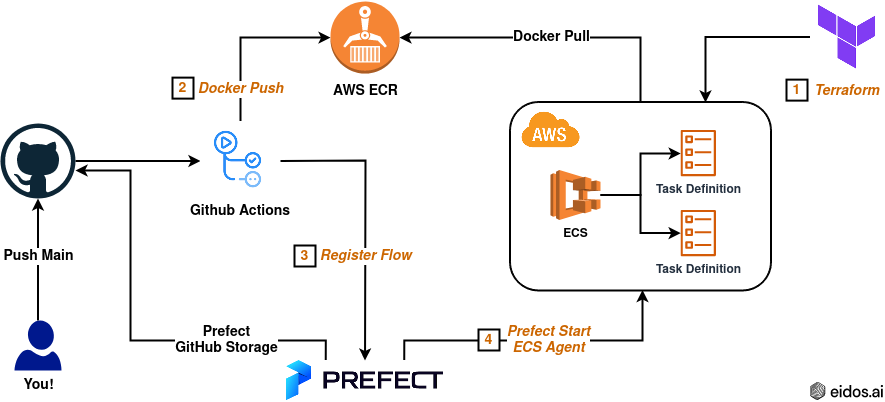

# Prefect AWS ECS Boilerplate #
In this project we present the basic structure needed to deploy multiple Flows with dependencies using GitHub Storage and an ECS Agent. We set up the ECS infrastructure with Terraform (1); with GitHub Actions we build and push a Docker image to ECR (2) and register the flows to Prefect (3); and, finally, we run the flows on Prefect Cloud UI with a local ECS Agent (4).


This boilerplate facilitates:
- Import from flow modules in different directories
- Automatic Prefect flow configuration and registration
- The use of GitHub Secrets and dotenv variables
- ECS Cluster setup with Terraform
- The connection to ECR and Prefect using GitHub Actions

## Requirements ##
This project uses Prefect, Docker and Terraform. 
- Install Prefect: `$ pip install prefect`
- Install Docker: `$ sudo apt install docker.io` 
- Install Terraform: `$ sudo apt-get install terraform`

## Config ##
To run this code you will need to clone this repository and configure your secrets/variables accordingly. 
- Add to Prefect Cloud Secrets a secret named **GITHUB_ACCESS_TOKEN** with your token (see [config_flows.py](flows/config_flows.py)).
- Add to GitHub Secrets:
    - A secret named **PREFECT_API_KEY** with your key (see [config_flows.py](flows/config_flows.py)).
    - Secrets named **AWS_ACCESS_KEY_ID** and **AWS_SECRET_ACCESS_KEY** with your id and your key (see [deploy.yml](.github/workflows/deploy.yml)).
- Make sure your AWS credentials file is in the path `"~/.aws/credentials"` (see [provider.tf](terraform/provider.tf)).
- Set your AWS account id, AWS region, image name, cpu and memory in [terraform.tfvars](terraform/terraform.tfvars). Terraform will create an AWS ECS task role, task execution role, task definition and cluster with the image name prefix. 
- Set your AWS region in [deploy.yml](.github/workflows/deploy.yml). 
- EXTRA: if you need to use a dotenv file (that doesn't have secrets): 
    - Make sure `.env` isn't in [.gitignore](.gitignore).
    - Uncomment the following from [deploy.yml](.github/workflows/deploy.yml):
    ```
     - name: Load .env file 
       uses: xom9ikk/dotenv@v1.0.2 
       with: 
         path: path/to/env/ 
    ```
    - Uncomment the following from [my_module1.py](src/my_module1.py):
    ```
    from dotenv import load_dotenv 

    load_dotenv() 
    my_env_var = os.getenv("MY_ENV_VARIABLE")
    ```
- Finally, push changes to your GitHub repository. 

## Setup ## 
Create AWS ECS task role, task execution role, task definition and cluster:
- `$ cd terraform` 
- `$ terraform init` 
- `$ terraform plan` 
- `$ terraform apply`

## Run ##
1. Build and push image to ECR, and register flows to Prefect:
    - Run workflow "Deploy" in GitHub Actions 
2. Start Prefect agent locally: 
    - `$ prefect agent ecs start --cluster hello-world-Cluster --label 'prod'`
3. Run flow on Prefect Cloud UI:
    - Hit **Quick Run** 